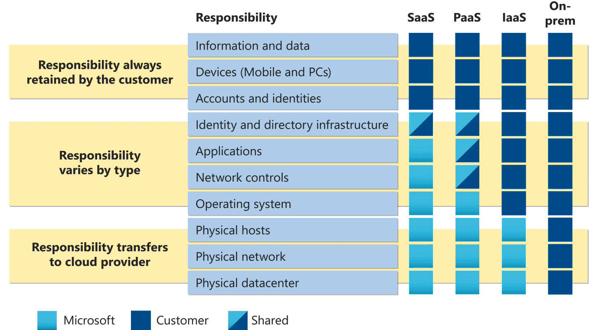
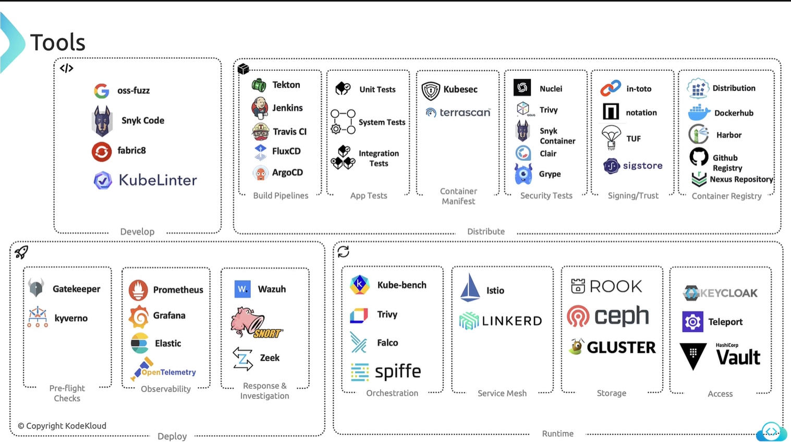

# KCSA

## 4 Cs of Cloud Native Security
1. **Cloud** - Datacenter, Network, Servers.
2. **Cluster** - Authentication, Authorization, Admission, Network Policy.
3. **Containers** - Restrict Images, Supply Chain, Sandboxing, Priveleged.
4. **Code** - Code Security Best Practices.

## Cloud Provider Security:
### Threat Management and Response Techniques
- Azure: Microsoft Sentinet, provides SIEM, SOAR.
- GCP: Security Command Center
- AWS: Guard Duty

### Web Application Firewalls (WAF)
- Azure: Azure WAF, provides security against SQL Injections and XSS Attacks.
- GCP: Google Cloud Armor, provides protection against DDoS Attack.
- AWS: AWS WAF, works as Load Balancer and with AWS CloudFront.

### Container Security:
- Azure: AKS
- GCP: GKE, Google's Anthos, Open Policy Agent.
- AWS: EKS, Bottlerocket, Kube-bench, CIS.

### Shared Responsibility Model:
- Cloud Interface like `network settings`, and `firewall settings` are managed by user.
- Cloud provider manages the `underlying hardware` that user does not has access to.


### Infrastructure Security:
- Network Configuration & Server Hardening.

- **Stages:**
  - **Stage 1**: IP address isolation for each service. Masking public IP address of node, or enforcing VPN access to reduce risk.
  - **Stage 2**: Open ports like Docker port can cause compromise in access. Using firewalls to restrict traffic to port exposing Docker can help. Network policies can also be used for underlying worker node VMs.
  - **Stage 3**: Previleged container can be used to escalate attacker's priveleges to exploit a vulnerability. Adhering to the principle of least privelege can be helpful in this situation. RBAC should be used to restrict the access to the Kubernetes Dashboard.
  - **Stage 4**: Attacker can read credentials stored as environment variables in pods and use them. Using Kubernetes secrets would have protected in this case. Securing etcd by enforcing TLS communication and RBAC.

## Kubernetes Isolation
- Namespace separation for each env like dev, test, prod.
- Multi-tenancy with namespaces.
- Implementing RBAC.
- Resource quota and limits.
- Security contexts to manage user access inside containers or to run them in non-root user mode.

## Artifact Repository and Image Security:
- **Vulnerability Scanning Tools:** Trivy & Clair.
- Use minimal base images from trusted sources.
### Build Artifacts:
- Files generated as a package after build, can be, code, package, WAR file, logs, report, container image. These are often stored in artifact repositories like Docker, Nexus Repository or JFrog.
### Enhancing Image Security with Digital Signatures:
1. Proactive Security Alerts.
2. Addressing Security Concerns.
3. Applying Digital Signatures.
4. Ensuring Image Authenticity.

## Code Level Security Practices:
- SQL Injection Attacks can happen if code is not properly tested.
- **SonarQube:** Detecting problematic code patterns, mitigating identified risks.
- **Third Party Dependencies:** OWASP security check can be performed.
- **Realtime Security Monitoring:** Datadog Application Security Monitoring (ASM).
- **Performance Monitoring:** Sysdig provides deep insights into containerized environments.


## Kubernetes Cluster Component Security

### API Server
- Authentication and Authorization.

### Kubernetes Controller Manager and Scheduler
- Should be run on the separated, isolated node from where the applications are running.
- Managing permissions using RBAC, to restrict these components to certain permissions only.
- Using TLS communication between components for communication.
- Implement auditlogging to these components using tools like Prometheus and Grafana.

### Securing Kubelet
- Kubeadm does not install Kubelet by default.
- By default, you can do anonymous curl on Kube API Server to check the existing pods.
- There are two ports:
  - 10250 - Serves API that allows full access.
  - 10255 - Serves API that allows unauthenticated read-only access.
- This default anonymous access flag (--anonymous-auth) can be set to false. Either in commandline or `kubelet-config.yaml` file.
- Certificates or API bearer tokens can be used by specifying them in commandline when starting kubelet service.

### Container Runtime Security
- Early Docker allowed to run with the root access on the host machine.
- **Container Vulnerabilities:**
  - Dirty Cow - Linux Kernel, allowed containers to get unauthorized root access.
  - RunC Container Breakout - Docker, Kubernetes etc, allowed attackers to rewrite the RunC functionality to gain root access.
  - Docker Container Escape - Docker
  - Containerd DoS vunerability
  - CRI-O Container Escape
- **Mitigations:**
  - Regular updates and patching.
  - Use package manager to update runtime.
  - Running containers with least priveleges.
    - This setting can be managed in pod manifest file under `spec->securityContext` field.
  - Use read only root file system for containers.
    - `spec->securityContext->readOnlyRootFileSystem: true`.
  - Limit resource usages.
  - Use security profiles.
    - Configure SELinux
    - Apply AppArmor profiles using Kubernets annotations.
  - Transitioning to supported runtimes.
  - Implementing logging and monitoring. Use tools like Fluentd, Logstash, and Prometheus for centralized logging and monitoring.

### Securing Kube-Proxy:
- Locate Kubeconfig file using:
``` bash
ps -ef | grep kube-proxy
```
- This command will give you the location of the kube proxy configuration file.
- In kube proxy config file, there will a reference to the kube config file. This is the config file that kube proxy uses to communicate with the API server.
- Check config file permissions to be set to 644 or stricter.
- Verify this file is owned by root.
- Secure the communication between kube proxy and API server.
  - Certificate and auth token is used in TLS communication between kube proxy and API server.
- Make sure audit logs are enabled.

### Securing the Pod
- The `spec->containers->securityContext->privileged` property should be set to false.
- Setting volume mounts to use hostpath can also be prone to attacks.
- We can implement policies to restrict users from creating pods with certian configurations.
- Policiy implementation was done using Pod Security Policy before, now it is done using Pod `Security Admission (PSA)` + `Pod Security Standards`.
- If a security policy is enabled, Admission Controllers validate the pod creation requests according to a preconfigured rule, if a request does not comply rules, it gets rejected.
- To enable it, we need to add `--enable-admission-plugins=PodSecurityPolicy` in our kube-apiserver service commandline arguments.
- Pod Security Policies are configured in YAMLs
- **Pod Security Admission:** 
  - Admission controller built-in to Kubernetes enforces Pod Security Standards. There are `three modes`:
  - **Enforce Mode:** Pods violating the policy are rejected.
  - **Audit Mode:** Pods violating the policy are allowed but recorded for auditing purposes.
  - **Warn Mode:** Pods violating the policy are allowed but generate warnings to alert users.
- There are `three profiles` are defined in PSA
  - Priveleged.
  - Baseline.
  - Restricted.
- These profiles can be applied with any mode at namespace level.

**For example:**
``` bash
kubectl label ns default pod-security.kubernetes.io/enforce=baseline
```
- **Authentication:**
  - Use *OpenID Connect* for authentication.

### Authentication
- You cannot directly create users in Kubernetes, for that, external tools are used. However, service accounts are a built-in functionality in Kubernetes.
- **Authenticattion Mechanisms:**
  - Static password file (not recommended).
  - Static token file.
  - Certificates.
  - Identity services.
- **Authorization Mechanisms in Kuberenetes:**
  - Node based authorization.
  - Role-based authorization.
    - rbac.authorization.k8s.io/v1, kind: Role.
    - There are `three rules for each role`: apiGroups, resources, verbs.
  - Attribute-based authorization.
  - Webhook.
- `kube auth can-i` command can be used to check access level to the cluster.


### Securing ETCD:
- ETCD is a key-value store that contains cluster configuration data, secrets and state information, certificates and keys.
- Encryption configuraion file needs to be created to encrypt ETCD data at rest.
- This encryption configuration then needs to be added in the `etc/kubernetes/manifests/etcd.yaml` under command `--encryption-provider-config=<configpath to yaml file>`.
- Using TLS for data in transit, to and from ETCD.
- Regular ETCD data backups using built-in snapshot functionality.

### Securing Container Networking
- Implementing network policies to change defualt behavior of Kubernetes of allowing every pod to access another pod.
- Using service meshes to implement Mutual TLS Traffic Management Observability.
- For network layer data encrytion, Kubernetes uses IPSec and WireGuard.
- Using namespaces to isolate networks.

### Kubectl Client Security
- Kubectl works with API Server.
- Kubectl uses kube config file to access cluster using the API Server.
- Kubectl can be in the master node, or outside of it.
- Another way to access API Server directly using port 6443 using curl with necessary credentials.
- Alternate way is to run Kubectl proxy service that uses the credentials from kube config files.
- Applications using cluster IP service type are also accessible using this proxy via curl.
- Kubectl port forward, allows to forward port from a laptop or computer to a service.

### Kubeconfig Security
- Defeault directory wehere kubectl reads the kube config from is `$HOME/.kube/config`.
- Contains clusters, contexts, and users.
- The kind of kube config is `Config`. 

### Securing Storage
- If storage supports native encryption, enabling encryption property in storage class will facilitate this encryption of data stored.
- Implementing access controls like read only access to users via roles.
- Implementing backups and disaster recovery with tools like velero, portworx, OpenEBS, Veeam Kasten.
- Monitoring and auditing.

### Segmentation & Isolation
- Default Namespaces Created upon Cluster Creation:
  - Kube-system
  - Default
  - Kube-public
- Resources within the same namespace can access each other with name.
- Resources in different namespaces should access each other with reference like a pod in default namespace can access a service service1 like: `service1.namespace.svc.cluster.local`. Namespace here is the name of the namespace.

### Auditlogging
- Auditing is built-into Kubernetes, and facilitated by the API Server.
- **Events Recorded by API Server upon a User Request:**
  - 1. RequestReceived.
  - 2. ResponseStarted.
  - 3. ResponseComplete.
  - 4. Panic (in case of errors)
- An audit policy is created to customize auditing by specifying auditing rules.
  - apiVersion: audit.k8s.io/v1
  - kind: Policy
  - omitStages:
  - rules:

### Kubernetes Threat Modeling
- **Threat Modeling:** Helps in finding potential threats and understand their impact.
- **Kubernetes Trust Boundaries:**
  - Clusters
  - Nodes
  - Pod boundaries
  - Container boundary

- **Persistence:**
  - The ability of an attacker to retain the system under control.
  - Foothold with container restarts.
  - Foothold with container/pod reboots.
  - Foothold with resiliance to node reboots.
  - Foothold wth resilaiance to node re-cycling.
- **Mitigating persistence risks:** RBAC for users and service accounts, secret management, hardening pod security, regular updates and patching.

- **Deinal of Service:**
  - *Attack Vectors for DoS:*
    - Add process to a running pod to overwhelm it.
    - Use priveleged container to modify content on the host or start a process on host.
    - Write new workloads on backend, i.e more workload on etcd to overwhelm cluster.
    - Create scale deployment using API server.
  - *Potential Attack Techniques:*
    - Exhaust compute resources.
      - Reduce worker node pool.
        - Bring down the kubelet.
        - Render kubelet healthcheck unresponsive.
    - Disrupt, renew, or restarting scheduling of workloads.
      - Prevent changes to desired cluster state.
      - Bring scheduler down.
      - Bring controller manager down.
    - Disrupt networking.
      - Bring kube proxy down.
      - Degrade CLI overlay network.

- **Mitigating Denial of Service Attacks:**
  - Set resource limits and requests at pod level.
  - Define resource quotas for namespaces.
  - Limit permissions assigned to service accounts.
  - Limit access of API Server to selected IPs.
  - Use logging and monitoring.

- **Malicious Code Execution:**
  - Poisoning the image repository.

- **Mitigating Malicious Code Execution:**
  - Scanning vulnerarabilies in images.
  - Applying patches.
  - Secure image pull secrets.
  - Use signed images.

### Platform Security
- **Reducing Base Image Footprint:**
  - Base image is the image created from `scratch`.
  - Parent image is the image that is used by base image.
  - Best practices:
    - Do not build images that combine applications.
    - Do not make containers persistent (storage).
    - Choosing the right image.
    - Use small, minimal images from tursted publishers.
    - Remove shells, package managers, and other tools from images.
    - Use multi-stage images with small sizes.
    - Google's distroless images.

- **Supply Chain Security:**
  - CVE: Common Vulnerabilities and Exposure.
  - CVE Database for finding known vulnerabilities.
  - CVE severity score determines levels from 1 to 10 or low, medium, high, critical.
  - Triviy can be used for CVE scanning on images.
  - Docker images can be saved as tar files that can be scanned using trivy.
  - Continuously rescan images.
  - Kubernetes admission controllers to scan images.
  - Have your own reposity with pre-scanned images ready to go.

- **Falco Overview (Observability):**
  - Tracks system calls to the kernel from user space to track and monitor activities.
  - Uses Falco kernel module (that sits right into the Linux kernel). That is the reason some managed service providers do not allow to set up Falco in to the cluster.
  - If Falco is installed as a regular package, it automatically installs its kernel module. In this method, Falco is independent of cluster as it sits directly on host.

- **Using Falco to Detect Threats:**
  - Install Falco on any node/nodes of the cluster as a package on host.
  - SSH into the host and run `journalctl -fu falco` to inspect the events generated by Falco.
  - Falco even logs if the shell is spawned or file is accessed from any container in the cluster.
  - **Falce Rules:**
  ``` yaml
      - rule: <Name of the rule>
      - desc: <Detailed Description of the rule>
      - Condition: <When to filter events matching teh rule>
      - Output: <Output to be generated for the event>
      - Priority: WARNING
  ```

- **Services Meshes:**
  - Service meshes help mitigate issues with repitition in network and auth config for different microservices in a central manner.
  - Istio uses Envoy proxy. And control plane of Istio uses Istiod.
  - Istio provides Encryption, Mutual TLS, Audit Logs.
  - Istio also provides certificate management system.

### PKI for K8s
- **Generating a Certificate:**
  - 1. Generate keys `openssl genrsa -out ca.key 2048`.
  - 2. Generate certificate signing request: `openssl req -new -key -subj "/CN=KUBERNETES-CA" -out ca.csr`.
  - 3. Sign certificate: `openssl x509 -req -in ca.csr -signkey ca.key -out ca.crt`
  - 4. Now we will have private key and root certificate that will be used to create new certificates.
  - Now, new certificates will be signed using this CA certificate, those certificates will be used for users and clients, and kubernetes components.
  - After creating a client certificated that is signed using CA certificate, pass that along with the key when launcing components, like etcd for example. Key and certificate will be passed into the commandline arguments.
  - Specified name for the particular component should be mentioned in the certificate.
  - These things can be passed as a configuration in form of .cnf file to the certificate signing request creation command.
  - Nodes too, are required to have their own certificates. Those certificate should be added SYSTEM:NODES group.
- Kubeadm automatically creates and manages certificates. However, if manually configured, the cluster needs explicit set up and creation of those certificates.


### DUMPS:

- Set --profiling, and --enable-profiling flags to false in scheduler to reduce attack surface.

**Cloud Native Security Layers:** Cloud -> Clusters -> Containers -> Code.
- Code: Implement TLS, limit port ranges, manage third-party dependencies, and apply static and dynamic code analysis.

**Security Controls & Frameworks:**
- STRIDE: Spoofing, Tampering, Repudiation, Information, Disclosure, Denial of Servcie, Elevation of Privilege.
- Standards & Frameworks: CIS Benchmarks, NIST, CSA, MITRE, ATT&CK, OCTAVE.

**Isolation Techniques:**
- **Namespace:** Ensure process isolation.
- **Network Policies:** Apply Ingress and Egress rules.
- **Policy Enforcement:** Prevent unauthorized actions.
- **RBAC (Role-Based Access Control):** Manage authentication and permissions effectively.

**Workload and Application Code Security:**
- **Workload Security:** Focus on securing the platform and monitoring using tools like `sysdig`.
- **Application Security:** Ensure the code in container images is secure by conducting vulnerability scans. Use automated security tools, enforce RBAC policies, and grant only necessary permissions to containers.
- Tools like `Kube-bench` can enforce security best practices within Kubernetes, including configuring appropriate security contexts.

### Security Principles:
- `Security by Design:` Security should be a design requirement from the start.
- `Secure Configuration:` Secure configurations should offer the best user experience.
- `Informed Choices:` Selecting insecure configurations should be a deliberate and informed choice.
- `Transition to Security:` The system should enable transitioning from insecure to secure states smoothly.
- `Secure Defaults:` Defaults should protect against common vulnerabilities and exploits.
- `Support for Exceptions:` Exceptions to secure configurations should be supported at a high level.
- `Defend Against Exploits:` Secure defaults should defend against widespread vulnerability exploits.
- `Understandable Security Limitations:` The security limitations of any system should be clear and explainable.

### Compliance Frameworks
- Defines what to do.
- **CIS Benchmarks:** Security configuration benchmarks for Kubernetes clusters.
- **NVD (National Vulnerability Database):** A database of known vulnerabilities and exposures.
- **NIST (National Institute of Standards and Technology):** A key resource for security standards and best practices.
- **GDPR (General Data Protection Regulation):** By European Union, about user data and its encryption
- **HIPAA (Health Insurance Portability and Accountability Act):** US regulation for patient health data.
- PCI DSS

### Threat Modeling Frameworks:
- Defines how to do it.
- **STRIDE:** Developed by Microsoft.
- **MITRE ATT&CK:** Deals with tactics and techniques.


### Supply Chain Compliance
- Make sure the external components used are verified and trusted.
- Use CNCF Supply Chain Security.
  - **Artifacts:** Track software components. Keyless signing using tools like `CoSign` to detect tampering in future.
  - **Metadata:** Record information about artifacts. SBOM (Software Bill of Materials), includes components, dependencies, and libraries. It is a file that can be downloaded to verify the integrity of the components of an application.
  - **Attestations:** Verify compliance. Makes sure the data is sent by the authentic source, tools like `in-toto` are used for this.
  - **Policies:** Apply compliance checks to ensure security throughout the supply chain. `policy-controller` for policy enforcement.


### Threat Intelligence:
- **Threat Intelligence:** Gathering indications of specific behaviours of potential attackers.
- **MITRE ATT&CK Framwork:** act as starting point to understand tricks and techniques of attackers.

### Develop -> Distribute -> Deploy -> Runtime
- Security risk management process that spans the development, distribution, deployment, and runtime phases of software lifecycle.

### Automation and Tooling:
- Cloud Native Security Whitepaper
- **Google OSS-Fuzz:** Check Open-Source software bugs and vulenarabilities using fuzz testing.
- **Snyk Code:** VS Code extension.
- **Fabric8 by RedHat:** VS Code extension for IDE based code analysis.
- **KubeLinter:** Checks syntax of manifests.
- **KubeSec:** Scans for vulnerabilites in YAML files.
- **Terrascan:** Works for K8s as well IaC in general for vulnerabilities and compliance issues.
- **Image Scanning:** Nuclei, Trivy, Snyk, Clair, Grype.
- **Signing & Trust:** In-toto, Notation, TUF, Sigstore.
- **Preflight Checks:** Gatekeeper (policy management using YAML), `Kyverno`.
- **Observability:** Prometheus, Grafana, Elastic, OpenTelemetry.
- **Response and Mitigation:** Wazuh (Security monitoring and intrusion detection), Snort, Zeek (Network security monitoring).
- **Kubescape:** Scans everything - clusters, pods, and manifests - against CIS benchmarks.
- **Kube-bench:** Focuses on scanning clusters for CIS compliance.
- **Orchestration:** Trivy, Kube-Bench, Falco, Spiffe (Facilitates identity management).
- **Service Mesh:** Istio, Linkerd.
- **Storage:** Rook, CEPH, Gluster.
- **Acess:** KeyCloak, Teleport, HashiCorp Vault.
- **Checkov:** Performs static analysis on manifests and checks for security threats.



### OCTAVE (Operationally Critical Threat, Asset, and Vulnerability Evaluation) threat modeling framework:
- Risk assessment methodology to identify and prioritize information security risks.
- It consists of three phases:
  - **Phase 1:** Identification of critical assets and threats to the system.
  - **Phase 2:** Assessment of vulnerabilities in the infrastructure.
  - **Phase 3:** Development of a security strategy and implementation plan to mitigate identified risks.

- **General Threat Actors:**
  - Malicious Insider.
  - Uninformed Insider.
  - Malicious Insider.


## Multiple Choice Questions (MCQs)

---

### 1. **Question:**

An enterprise utilizing Azure for their cloud solutions requires a tool to perform security analysis and offer actionable recommendations to enhance their security posture.  
**Which Azure service is best suited for this purpose?**


### ✅ **Answer:**

**Azure Security Center**

Azure Security Center is a unified infrastructure security management system that strengthens the security posture of your data centers and provides advanced threat protection across all of your Azure resources.

---

### 2. **Question**
Scenario: A technology firm needs to ensure that all deployments in their Kubernetes cluster adhere to specific security protocols, including mandatory security labels.
**Which feature can enforce these deployment standards within the cluster?**


### ✅ **Answer:**

**Pod Security Admission (PSA)

---

### 3. **Question:**

A company has migrated its services to a public cloud provider. They need to ensure that the virtual machines hosting their applications are properly secured.
**Which entity is responsible for configuring the network security groups and firewalls for these virtual machines?**


### ✅ **Answer:**

**The Customer**

When migrating services to a public cloud provider, the customer is responsible for configuring network security groups and firewalls for their virtual machines to ensure proper security.

---

### 4. **Question**

Scenario: A user disputes a financial transaction, claiming they never authorized it. You need a way to verify the legitimacy of the transaction.
**Which STRIDE category is relevant here, and what solution can help address this issue?**

### ✅ **Answer:**

**Repudiation**

---

### 5. **Question**

Scenario: You are required to automate compliance checks and generate audit reports.
**Which tools are appropriate for this purpose?**

### ✅ **Answer:**

**Chef InSpec and OpenSCAP**

---

### 6. **Question**

Scenario: A company wants to detect and respond to unauthorized or suspicious activities in their Kubernetes cluster.
**What should be included as part of their monitoring and auditing strategy?**

### ✅ **Answer:**

**Enabling audit logging for the Kubernetes API and monitoring access to secrets**

---

### 7. **Question**

Scenario: An online retailer needs to prevent unauthorized access to Kubernetes management components.
**What is the best measure they should implement?**

### ✅ **Answer:**

**Binding etcd to localhost**

---

### 8. **Question**

Scenario: A logistics company is concerned about SQL injection attacks on their backend API services.
**What best practice should they adopt to mitigate this risk?**

### ✅ **Answer:**

**Using prepared statements and parameterized queries**

-------------------------------

- What is the primary difference between MicroVM and User-Space Kernel approaches in cloud native security?
  - User-space kernels intercept system calls in user space

- Which Kubernetes resource is used to enforce Pod Security Standards within a namespace?
  - Pod Security Admission Controller

- Which of the following are best practices for securing etcd in a Kubernetes cluster? (Select all that apply)
  - Enable TLS encryption for all communication with etcd
  - Limit access to etcd endpoints to trusted networks only
  - Use authentication and authorization mechanisms for etcd access
  - Store etcd backups in a secure and access-controlled location

- Which Kubernetes or related object defines how to build and deploy an application from source code?
  - BuildConfig (OpenShift)

- In Kubernetes NetworkPolicy configuration, what podSelector configuration creates a default-deny-all policy that applies to all pods in a namespace?
  - Empty selector: {}
> Empty pod selector selectors selects all pods in the namespace.

- Which guidance document provides best practices for mitigating supply chain risks in Kubernetes environments?
  - NSA/CISA Kubernetes Hardening Guidance

- Which of the following restrictions does the 'baseline' Pod Security Standard enforce (Disallow Context)? (Select all that apply)
  - Privileged containers (securityContext.privileged: true)
  - Host networking (hostNetwork: true)
  - Host PID namespace (hostPID: true)
  - Host IPC namespace (hostIPC: true)
  - HostPath volumes
  - Adding dangerous Linux capabilities (e.g., NET_RAW, SYS_ADMIN)
  - allowPrivilegeEscalation: true
  - procMount: Unmasked
  - Unsafe volume types (e.g., nfs, cifs, flocker, gitRepo, etc.)

- Which Kubernetes resources, if compromised, could lead to significant security breaches and should be audited carefully? (Select all that apply)
  - Secrets, ServiceAccounts

- Can you enforce more than one Pod Security Admission (PSA) policy level concurrently within a single namespace?
  - No, only one policy level per namespace

- Which configuration in a Kubernetes container's securityContext is used to drop all Linux capabilities, effectively removing extra privileges?
  - capabilities: {drop: ['ALL']}

- Which tool is specifically designed to perform static security analysis of Kubernetes manifests to identify potential security issues?
  - kubesec

- In Kubernetes, which securityContext setting ensures that a container runs as a non-root user to enhance security?
  - runAsNonRoot: true

- Which methods can be used to isolate resources effectively in a multi-tenant Kubernetes environment? (Select all that apply)
  - Deploying separate Kubernetes clusters for each tenant
  - Using Kubernetes namespaces combined with Role-Based Access Control (RBAC)
  - Applying Kubernetes Network Policies to restrict traffic

- Which command is recommended to check the readiness and status of Kubernetes cluster components?
  - kubectl get --raw='/readyz?verbose'

- Which strace command attaches to an already running process with PID 1234 to trace its system calls?
  - strace -p 1234

- Which command calculates the SHA256 checksum of the file '/usr/bin/kubelet' on a Linux system?
  - sha256sum /usr/bin/kubelet

- In a Kubernetes NetworkPolicy specification, which field defines the allowed egress destinations for Pods?
  - Egress

- Which field in the Pod spec can you use to disable privilege escalation for all containers in the Pod?
  - spec.containers.securityContext.allowPrivilegeEscalation: false

- Which of the following are critical security hardening measures for the Kubernetes API server? (Select all that apply)
  - Disable anonymous authentication
  - Enable RBAC authorization
  - Enable etcd encryption for secrets

- How do you configure a Kubernetes audit policy rule to log events for all resources within a specific namespace?
  - Use 'namespaces: ["<namespace>"]' under the rule's 'namespaces' field

- Which of the following controllers is NOT managed by the kube-controller-manager in Kubernetes?
  - Ingress Controller

- What is the role of the 'namespaceSelector' field in a Kubernetes NetworkPolicy?
  - To select Pods in specific namespaces for ingress or egress rules

- Which Kubernetes admission controller runs first during the admission control process?
  - MutatingAdmissionWebhook

- Which of the following securityContext fields are commonly applied at the Pod level in Kubernetes? (Select all that apply)
  - runAsUser, fsGroup, seLinuxOptions

- How can you update the container image of a Kubernetes deployment without modifying other deployment configurations?
  - Use the 'kubectl set image' command to update the image

- To enable audit logging in Kubernetes, which flag must be added to the API server configuration to specify the log file path?
  - --audit-log-path

- Which command lists all processes currently listening on TCP and UDP ports on a Linux system, including the associated process IDs?
  - sudo ps aux | grep LISTEN

- Which kubectl command allows you to view the events occurring in a Kubernetes cluster, such as pod lifecycle changes and errors, using the most current recommended method?
 - kubectl events